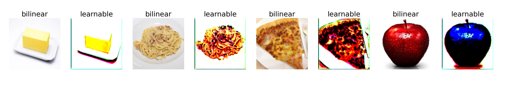

# Learning to Resize Images - PyTorch
PyTorch implementation of [Learning to Resize Images for Computer Vision Tasks](https://arxiv.org/abs/2103.09950) by Hossein Talebi, and Peyman Milanfar.

This paper proposed an optimized based pre-processing module to resize images.
## Usage
```python
class Resizer(in_chs, out_size, n_filters, n_res_blocks, mode)
```

* **in_chs** (int) - Number of channels in the input image
* **out_size** (int or tuple) - The size of images the resizer resize to
* **n_filter** (int) - Number of output channels in the Resizer's convolution layers. Default: 16
* **n_res_blocks** (int) - Number of residual blocks in the Resizer. Default: 1
* **mode** (str) - Algorithm for interpolation. See [PyTorch docs](https://pytorch.org/docs/stable/generated/torch.nn.functional.interpolate.html) for details. Default: 'bilinear'

You can build the resizer on top of your model for different computer vision tasks.

Example:
```python
from resizer import Resizer
class Classifier(nn.Module):
    def __init__(self, ...):
        super(Classifier, self).__init__()
        self.resizer = Resizer(in_chs=3, out_size=128)
        self.model = YourModel
    def forward(self, x):
        x = self.resizer(x)
        x = self.model(x)
        return x
```

## Experiments
### Dataset
[Food-11](https://www.kaggle.com/vermaavi/food11)
> *This is a dataset containing 16643 food images grouped in 11 major food categories.*

### Training
Resize 512x512 to 128x128 using two diffrenet methods and fine tune for 5 epochs. 

### Result
| Model  |Resizer  |Parameters  |Top-1 Acc|
|--------|---------|-----------:|--------:|
|vgg11_bn|bilinear |128,816,907 |0.87481  |
|vgg11_bn|learnable|128,833,694 |0.88646  |
|vgg13_bn|bilinear |129,001,803 |0.89423  |
|vgg13_bn|learnable|129,018,590 |0.89901  |
|Resnet50|bilinear |23,530,571  |0.89512  |
|Resnet50|learnable|23,547,358  |0.89961  |



## Reference

### Papers
1. Hossein Talebi, and Peyman Milanfar. "Learning to Resize Images for Computer Vision Tasks."

### Implementation
1. https://github.com/pytorch